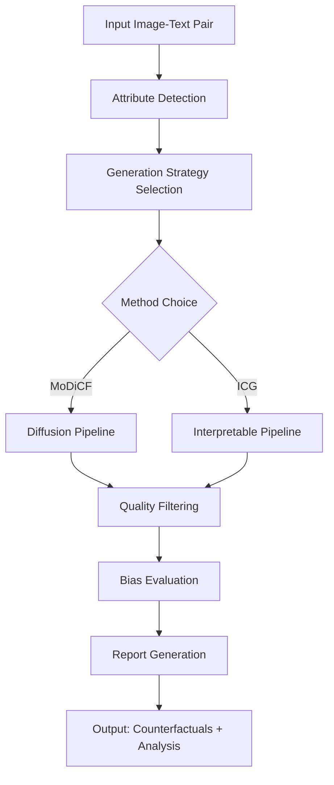

# Architecture Documentation

## System Overview

The Multimodal Counterfactual Lab is designed as a modular, extensible platform for generating and evaluating counterfactual multimodal data to assess fairness and robustness in Vision-Language Models (VLMs).

## High-Level Architecture

```
┌─────────────────────────────────────────────────────────────┐
│                    Multimodal Counterfactual Lab            │
├─────────────────────────────────────────────────────────────┤
│  Web Interface (Streamlit)  │  CLI Interface (Typer)        │
├─────────────────────────────────────────────────────────────┤
│                    Core API Layer                           │
├─────────────────────────────────────────────────────────────┤
│  Generation Methods  │  Evaluation Metrics  │  Bias Analysis│
│  ├─ MoDiCF          │  ├─ CITS Score       │  ├─ Fairlearn  │
│  ├─ ICG             │  ├─ Demographic      │  ├─ AIF360     │
│  └─ Custom Pipeline │  │   Parity          │  └─ Custom     │
│                     │  └─ Equal Odds       │                │
├─────────────────────────────────────────────────────────────┤
│                    Data Processing Layer                     │
│  ├─ Image Processing (PIL, OpenCV, Kornia)                  │
│  ├─ Text Processing (Transformers)                          │
│  ├─ Attribute Detection & Control                           │
│  └─ Skew-Aware Sampling                                     │
├─────────────────────────────────────────────────────────────┤
│                    Model Integration Layer                   │
│  ├─ Diffusion Models (Stable Diffusion, DALL-E)           │
│  ├─ Vision-Language Models (CLIP, ALIGN, FLAVA)            │
│  ├─ Language Models (BERT, GPT)                            │
│  └─ Custom Model Adapters                                   │
├─────────────────────────────────────────────────────────────┤
│                    Infrastructure Layer                      │
│  ├─ Storage (Local, S3, HuggingFace Hub)                   │
│  ├─ Monitoring (Prometheus, Grafana)                        │
│  ├─ Containerization (Docker)                               │
│  └─ CI/CD (GitHub Actions)                                  │
└─────────────────────────────────────────────────────────────┘
```

## Core Components

### 1. Generation Engine

**MoDiCF (Diffusion-based)**
- Primary method for high-quality counterfactual generation
- Utilizes Stable Diffusion with fine-grained attribute control
- Preserves context while modifying protected attributes

**ICG (Interpretable Counterfactual Generation)**
- Text-first approach with explicit reasoning
- Provides explanations for attribute changes
- Better for compliance and audit trails

### 2. Evaluation Framework

**Fairness Metrics**
- Demographic Parity
- Equal Opportunity
- Disparate Impact
- Statistical Parity Distance

**Quality Metrics**
- CITS (Counterfactual Image-Text Score)
- Realism Assessment
- Attribute Fidelity
- Diversity Measures

### 3. Data Flow



## Key Design Principles

### 1. Modularity
- Pluggable generation methods
- Extensible evaluation metrics
- Configurable pipelines

### 2. Fairness-First
- Built-in bias detection
- Regulatory compliance features
- Transparent decision making

### 3. Scalability
- Containerized deployment
- GPU optimization
- Batch processing support

### 4. Reproducibility
- Seed management
- Version tracking
- Configuration snapshots

## API Design

### Core Classes

```python
class CounterfactualGenerator:
    """Main interface for counterfactual generation"""
    def generate(image, text, attributes, method="modicf")
    def batch_generate(dataset, config)
    def visualize_results(counterfactuals)

class BiasEvaluator:
    """Fairness and bias evaluation"""
    def evaluate(model, counterfactuals, metrics)
    def generate_report(results, format="regulatory")
    def compliance_check(results, standard="eu_ai_act")

class Pipeline:
    """Extensible processing pipeline"""
    def add_step(name, function)
    def run(dataset)
    def validate_results()
```

### Configuration Management

```yaml
# config.yaml
generation:
  method: "modicf"
  parameters:
    guidance_scale: 7.5
    num_inference_steps: 50
    
evaluation:
  metrics: ["demographic_parity", "cits_score"]
  thresholds:
    fairness_threshold: 0.1
    quality_threshold: 0.8

data:
  batch_size: 32
  max_samples: 10000
  attributes: ["gender", "race", "age"]
```

## Security Considerations

### 1. Model Security
- Input validation for all image/text inputs
- Rate limiting for API endpoints
- Model weight verification

### 2. Data Privacy
- No persistent storage of biometric data
- Anonymization of sensitive attributes
- GDPR compliance measures

### 3. Bias Mitigation
- Regular bias audits of generation models
- Diverse training data requirements
- Ethical review processes

## Performance Characteristics

### Throughput
- MoDiCF: ~10 counterfactuals/minute (GPU)
- ICG: ~20 counterfactuals/minute (GPU)
- Batch processing: 1000+ images/hour (multi-GPU)

### Resource Requirements
- Minimum: 16GB RAM, 8GB VRAM
- Recommended: 32GB RAM, 24GB VRAM
- Storage: 50GB for models, 100GB+ for datasets

## Deployment Architecture

### Development
```
Developer Machine
├── Docker Compose (dev)
├── Local GPU support
└── Hot reloading
```

### Production
```
Kubernetes Cluster
├── API Gateway (Nginx)
├── Application Pods
├── GPU Node Pool
├── Redis Cache
├── PostgreSQL
└── Monitoring Stack
```

## Extension Points

### 1. Custom Generation Methods
```python
class CustomMethod(GenerationMethod):
    def generate_counterfactual(self, image, text, attributes):
        # Your implementation
        pass
```

### 2. Custom Metrics
```python
class CustomMetric(FairnessMetric):
    def evaluate(self, model, counterfactuals):
        # Your evaluation logic
        pass
```

### 3. Custom Pipelines
```python
class CustomPipeline(Pipeline):
    def __init__(self):
        self.add_step("preprocess", self.custom_preprocessing)
        self.add_step("generate", self.custom_generation)
        self.add_step("evaluate", self.custom_evaluation)
```

## Quality Assurance

### Testing Strategy
- Unit tests for all core components
- Integration tests for pipeline flows
- Performance benchmarks
- Bias validation tests

### Monitoring
- Generation quality metrics
- System performance metrics
- Bias drift detection
- User satisfaction tracking

## Compliance Framework

### Regulatory Standards
- EU AI Act compliance
- GDPR data protection
- IEEE standards for AI bias
- ISO/IEC 23053 framework

### Audit Trail
- Generation parameters logging
- Evaluation results tracking
- Model version management
- Decision reasoning records